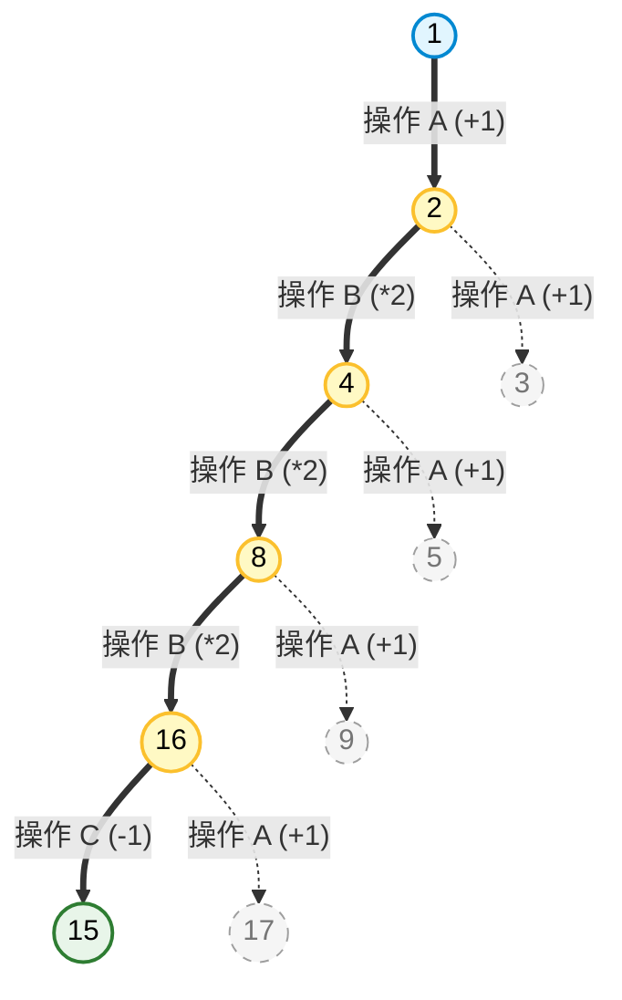

**时间限制： 1.0 秒
【题目描述】
在智能网联汽车队列中，车辆通过 V2V 通信协调行驶，并实时调整与前车的车间距，定义当前车间距为一个正整数，初始间距为 1（单位：米）。一种自适应间距控制策略允许在每一轮控制周中，对当前间距执行三种原子操作之一：
• A 操作（线性增加）：令间距 +1。
• B 操作（倍增扩大）：令间距 ×2。
• C 操作（回退缩小）：令间距 −1，但仅当当前间距严格大于 1 时允许执行（间距始终保持为正整数）。
每执行一次操作计为一步。现给定目标间距 n，请你构造一条从 1 到 n 的操作序列，使总步数最少。若存在多条最少步数的序列，输出字典序最小的操作串。
【输入格式】
从标准输入读入数据。
一行一个整数 n，表示目标车间距。
【输出格式】
输出到标准输出。
第一行输出一个整数 S，表示最少操作步数。
第二行输出一个长度恰好为 S 的字符串，由 A、B、C 构成，表示最优操作序列。
【数据范围与约定】
对于 10% 的数据，n ≤ 10。
对于 30% 的数据，n ≤ 500。
对于 50% 的数据，n ≤ 3000。
对于 100% 的数据，1 ≤ n ≤ $10^9$ 。**

## **解题思路：** 
本题要求寻找从初始间距 $1$ 到目标间距 $n$ 的最少操作步数 。若存在多条最少步数的序列，则要求输出字典序最小的操作串 。可用操作有三种：加一（A）、乘二（B）、减一（C）。

由于目标值 $n$ 的最大数据范围高达 $10^9$ ，使用传统的由前向后的广度优先搜索（BFS）会导致状态空间爆炸，时间和空间复杂度均无法满足要求。因此，我们需要采用逆向思维结合记忆化搜索（动态规划）的方法来进行优化。

从状态 $n$ 逆推回状态 $1$ 时：

- 如果当前数值为偶数，最快速缩小问题规模的方法是除以2（对应正向的乘二操作 B）。
    
- 如果当前数值为奇数，它只能由偶数加一或减一得到，因此我们分为两种情况：走向 $n-1$（对应正向操作 A）或走向 $n+1$（对应正向操作 C）。

通过这种逆向的折半策略，每次进入奇数分支后，下一步必然生成偶数并立即减半，这能将整个搜索树的深度严格限制在 $O(\log n)$ 级别，从而完美剪去了海量的无效冗余分支。


## **具体解法：**


- **逆向思维**：
    
    我们将问题反转，即从目标间距 $x$ 变回初始间距 $1$。对应的逆向操作为：
    
    - 逆向A（原操作A $+1$）：使 $x$ 变为 $x-1$（代价1步，记录字符 'A'）。
        
    - 逆向B（原操作B $\times2$）：使 $x$ 变为 $x/2$，仅当 $x$ 为偶数时可行（代价1步，记录字符 'B'）。
        
    - 逆向C（原操作C $-1$）：使 $x$ 变为 $x+1$（代价1步，记录字符 'C'）。
    
- **严格的分支优化**：
    
    - **当 $x$ 为偶数时，唯一最优解是“除以2”**：如果采取加一或减一操作，必然需要走两步才能到达相邻的偶数后再除以2（例如 $(x-2)/2$），而在 $x$ 的基础上直接除以2，不仅步数更少，而且缩减规模最快。因此，对于偶数，**不产生任何分支**，直接转移到 $x/2$。
        
    - **当 $x$ 为奇数时，产生两个分支**：奇数无法直接除以2，必须先通过 $+1$（逆向C）变为 $x+1$，或通过 $-1$（逆向A）变为 $x-1$，使其成为偶数后再继续向下除以2。
        
    - **特判 $x=2$**：从 $1$ 到 $2$ 既可以通过 $+1$（操作A），也可以通过 $\times 2$（操作B）。两者步数皆为1，但为了满足题目要求的字典序最小，当 $x=2$ 时，强制选取操作 'A'。
    
- **记忆化**：
    
    由于每次进入奇数分支后，下一步必然是偶数并被立即除以2，搜索树在任意一层最多只保留两个相邻的数值（如 $\lfloor x/2^d \rfloor$ 和 $\lceil x/2^d \rceil$）。利用哈希表 `unordered_map` 记录已经求得的最优状态，即可彻底避免重复计算。
## **运行结果：**
|                测试用例 10 的结果                |                测试用例 15 的结果                | 测试用例 1000000000的结果                        |
| :---------------------------------------: | :---------------------------------------: | ----------------------------------------- |
| ![[Pasted image 20260617194503.png\|222]] | ![[Pasted image 20260617193823.png\|206]] | ![[Pasted image 20260617194234.png\|255]] |
 
## **运行结果分析：**
 程序运行结果与题目给定的样例输出完全一致 。对于样例1输入 $10$ ，程序正确推导出了 $1 \to 2 \to 4 \to 5 \to 10$ 的4步最优路径 ABAB 。对于样例2输入 $15$ ，程序得出了 $1 \to 2 \to 4 \to 8 \to 16 \to 15$ 的5步最优路径 ABBBC 。由于算法单次查询的时间复杂度仅为 $O(\log n)$，在处理 $10^9$ 的满分数据时，耗时远低于 $1.0$ 秒的限制 。
源代码
``` C++
#include <iostream>

#include <string>

#include <unordered_map>

#include <chrono>

using namespace std;

  

// 记忆化哈希表，存储从 1 演化到状态 x 的 {最少步数, 操作字符串}

unordered_map<long long, pair<int, string>> memo;

pair<int, string> dfs(long long x) {

    if (memo.count(x)) {

        return memo[x];

    }  

    if (x==1) return {0, " "};

    if (x==2) return {1, "A"};

    if (x%2==0) {

        auto P = dfs(x/2);

        P.first += 1;  

        P.second += "B";    

        return memo[x] = P;

    }

    else {

        auto P1 = dfs(x-1);

        P1.first += 1;

        P1.second += "A";  

        auto P2 = dfs(x+1);

        P2.first += 1;

        P2.second += "C";      

        if (P1.first < P2.first) {

            return memo[x] = P1;

        }

        else {

            return memo[x] = P2;

        }

    }

}

int main() {

    ios_base::sync_with_stdio(false);

    cin.tie(NULL);

  

    long long n;

    if (cin >> n) {

        // 在核心算法开始前，打个时间戳

        auto start_time = chrono::high_resolution_clock::now();

  

        // 核心执行逻辑

        pair<int, string> ans = dfs(n);

        cout << ans.first << "\n";

        if (ans.first > 0) {

            cout << ans.second << "\n";

        }

  

        // 在核心算法结束后，再打个时间戳

        auto end_time = chrono::high_resolution_clock::now();

  

        // 计算时间差 (这里转换为微秒，1秒 = 1,000,000微秒)

        auto duration = chrono::duration_cast<chrono::microseconds>(end_time - start_time);

        cout << "-----------------------\n";

        cout << "算法执行耗时: " << duration.count() << " 微秒 (us)\n";

    }

    return 0;

}
```