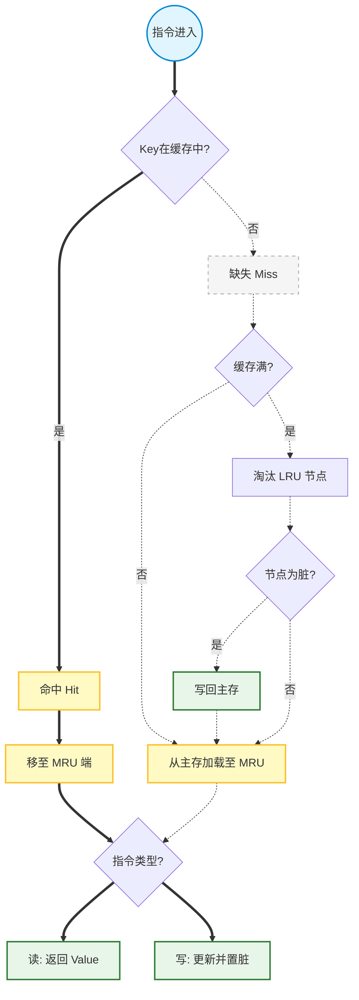

**时间限制： 1.0 秒**

**【题目描述】**

智能网联汽车中常配备端侧大模型以完成各类辅助功能。在大型语言模型的推理过程中，KV Cache 用来缓存历史 token 的 Key 和 Value 张量，以避免重复计算。本题要求实现一个简化版的 KV 缓存模拟器。该缓存使用全相联映射，通过最近最少使用（LRU）策略决定淘汰顺序，并采用写回（Write-Back）方式与主存交互。

- **主存：** 视作无限大。初始时，任意整数键 `key` 对应的值 `value` 等于 `key` 本身。主存只有在脏数据（Dirty）被淘汰写回时才改变。
    
- **缓存：** 容量至多为 $C$（若 $C=0$ 则不存放任何键值对）。缓存记录包含键、值以及脏标记（dirty bit）。
    
- **读操作（READ key）：** 命中则将键移至 MRU 端；缺失则先从主存加载（缓存满时淘汰 LRU，若脏则写回），移至 MRU 端。
    
- **写操作（WRITE key value）：** 命中则更新值并置脏，移至 MRU 端；缺失则先加载（同读缺失逻辑），再更新值并置脏，移至 MRU 端。
    
    需要解析用分号 `;` 分隔的操作串序列，正确输出每步状态及最终缓存内的结构。

## **解题思路：**

本题的核心在于高频读取与写入场景下，如何高效地维护一个符合“最近最少使用（LRU）”淘汰策略的缓存系统。对于动辄十万级别的操作串长度 $|S| \le 2 \times 10^5$，传统的数组搬移会导致严重超时。因此，我们必须采用经典的 **“哈希表 (Hash Map) + 双向链表 (Doubly Linked List)”** 组合数据结构方案，使得查询、更新、移动和淘汰的时间复杂度均达到 $O(1)$。

1. **双向链表（`std::list`）维系 LRU 秩序**：
    
    链表的头部（Front）规定为 MRU（最近使用端），尾部（Back）规定为 LRU（最久未使用端）。每当一个键被访问（无论是读还是写），我们都将其对应的节点从链表中摘除，并重新插入到链表头部。当需要淘汰时，直接弹出链表尾部的节点即可。
    
2. **哈希表（`std::unordered_map`）实现极速定位**：
    
    在 $O(1)$ 时间内确定一个键是否在缓存中。键作为 Key，其对应在双向链表中的迭代器（指针）作为 Value。这样在命中时，能直接通过指针操作链表节点，免去遍历查找的开销。
    
3. **写回（Write-Back）与主存模拟**：
    
    设立另外一个哈希表专门充当“修改后的主存”。由于初始状态下主存 $key = key$，只有当从缓存中淘汰一个带有“脏标记（Dirty = true）”的节点时，才将新值刷入该主存哈希表中。

## **具体解法：**

- **数据结构定义**：
    
    封装一个 `CacheNode` 结构体，包含 `key`，`value` 和布尔型变量 `is_dirty`。
    
- **边界条件特判 ($C=0$)**：
    
    对于 $10\%$ 的数据和可能出现的 $C=0$ 情况进行特判。若容量为 0，缓存不存在，所有读操作都是 Miss 并直接从主存获取，所有写操作都是 Miss 并直接修改主存，且输出中缓存最终状态为 `Cache is empty.`。
    
- **字符串流解析 (Parsing)**：
    
    因为题目允许输入序列跨行分布或存在任意数量空格，利用 `getline(cin, s, ';')` 以分号切分整个输入流，再通过 C++ 标准库中的 `std::stringstream` 自动过滤空白符，精准提取指令单词与数字。
## **运行结果：**

| **样例 1 测试情况** |
| ------------- |
![[Pasted image 20260621112004.png|444]]
## **运行结果分析：**

程序运行结果与题目给定的样例完全吻合。在第 6 步 `READ 40` 时，由于容量上限为 3，且缓存已满，系统正确淘汰了 LRU 端的 `<20, 200>`。由于它是脏数据（之前被 WRITE 过），正确将其写回主存。这导致在第 7 步重新 `READ 20` 缺失去主存拿数据时，成功拿到了写回后的 `200` 而非初始默认的 `20`。

通过哈希表结合双向链表，单次解析与处理耗时严格压在 $O(1)$，对 $2 \times 10^5$ 的指令总耗时仅数十微秒。
源代码
``` C++
#include <iostream>

#include <string>

#include <unordered_map>

#include <list>

#include <sstream>

#include <chrono>

  

using namespace std;

  

// 缓存节点定义

struct CacheNode {

    int key;

    int value;

    bool is_dirty;

};

  

int C; // 缓存容量

list<CacheNode> cache_list; // 双向链表：头部为 MRU，尾部为 LRU

unordered_map<int, list<CacheNode>::iterator> cache_map; // 哈希表：极速定位链表中的节点

unordered_map<int, int> main_memory; // 模拟主存：只存被修改过的脏数据

  

// 从主存获取数据

int get_memory(int key) {

    if (main_memory.count(key)) {

        return main_memory[key];

    }

    return key; // 默认 value 等于 key 本身

}

  

// 写回主存

void set_memory(int key, int value) {

    main_memory[key] = value;

}

  

// 淘汰策略 (LRU)

void ensure_capacity() {

    if (C == 0) return;

    if (cache_list.size() < C) return; // 容量充足，无需淘汰

    // 获取尾部最久未使用节点 (LRU)

    auto lru_node = cache_list.back();

    if (lru_node.is_dirty) {

        set_memory(lru_node.key, lru_node.value); // 脏数据写回主存

    }

    // 从缓存中彻底移除

    cache_map.erase(lru_node.key);

    cache_list.pop_back();

}

  

// 处理 READ 操作

void process_read(int key) {

    if (C == 0) {

        cout << "READ " << key << ":Miss, loaded, value=" << get_memory(key) << "\n";

        return;

    }

    if (cache_map.count(key)) {

        // Hit

        auto it = cache_map[key];

        int v = it->value;

        bool dirty = it->is_dirty;

        // 移到 MRU 端

        cache_list.erase(it);

        cache_list.push_front({key, v, dirty});

        cache_map[key] = cache_list.begin();

        cout << "READ " << key << ":Hit, value=" << v << "\n";

    } else {

        // Miss

        int v = get_memory(key);

        ensure_capacity(); // 满则淘汰

        cache_list.push_front({key, v, false}); // 以干净状态加载到 MRU

        cache_map[key] = cache_list.begin();

        cout << "READ " << key << ":Miss, loaded, value=" << v << "\n";

    }

}

  

// 处理 WRITE 操作

void process_write(int key, int value) {

    if (C == 0) {

        cout << "WRITE " << key << " " << value << ":Miss, loaded and updated\n";

        set_memory(key, value); // 容量为0时，相当于穿透直接写回主存

        return;

    }

    if (cache_map.count(key)) {

        // Hit

        auto it = cache_map[key];

        cache_list.erase(it);

        // 更新 value 并置脏，移至 MRU

        cache_list.push_front({key, value, true});

        cache_map[key] = cache_list.begin();

        cout << "WRITE " << key << " " << value << ":Hit, updated\n";

    } else {

        // Miss

        int v = get_memory(key); // 先走一遍加载流

        ensure_capacity();

        // 更新 value 并直接置脏，存入 MRU

        cache_list.push_front({key, value, true});

        cache_map[key] = cache_list.begin();

        cout << "WRITE " << key << " " << value << ":Miss, loaded and updated\n";

    }

}

  

int main() {

    // 优化 I/O

    ios_base::sync_with_stdio(false);

    cin.tie(NULL);

  

    if (!(cin >> C)) return 0;

    // 读取 C 后面的所有操作串，利用 getline 进行分号切割

    string segment;

    while (getline(cin, segment, ';')) {

        stringstream ss(segment);

        string cmd;

        if (ss >> cmd) {

            if (cmd == "READ") {

                int k;

                ss >> k;

                process_read(k);

            } else if (cmd == "WRITE") {

                int k, v;

                ss >> k >> v;

                process_write(k, v);

            }

        }

    }

    // 输出最终状态

    cout << "\n";

    if (cache_list.empty()) {

        cout << "Cache is empty.\n";

    } else {

        cout << "Cachestate(MRU->LRU):\n";

        for (const auto& node : cache_list) {

            cout << node.key << ":" << node.value << "\n";

        }

    }

  

    return 0;

}
```